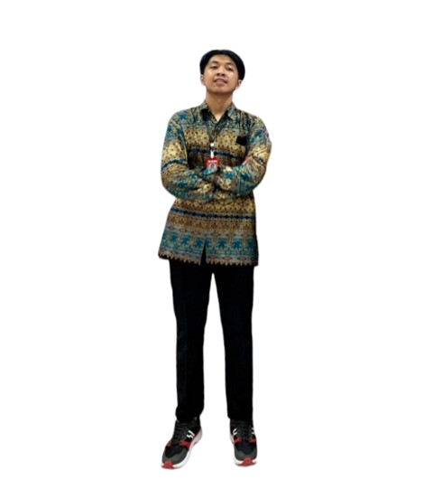

<h1 align="center">Hi 👋, I'm Muhammad Rizaldy Alifiansyah</h1>
<h3 align="center">A passionate Frontend Developer, UI UX, and Project Manager</h3>

  

- 👨‍💻 All of my projects are available at [http://mrzalf-portfolio.netlify.app](http://mrzalf-portfolio.netlify.app)

- 💬 Ask me about **Programming, Designing, and Project Management**

- 📫 How to reach me **rizaldy.alifiansyah27@gmail.com**

- 📄 Know about my experiences [linkedin.com/in/mrzalf](linkedin.com/in/mrzalf)

- ⚡ Fun fact **I think I am funny**

<h3 align="left">Connect with me:</h3>

<h3 align="left">Languages and Tools:</h3>

              

&nbsp;

